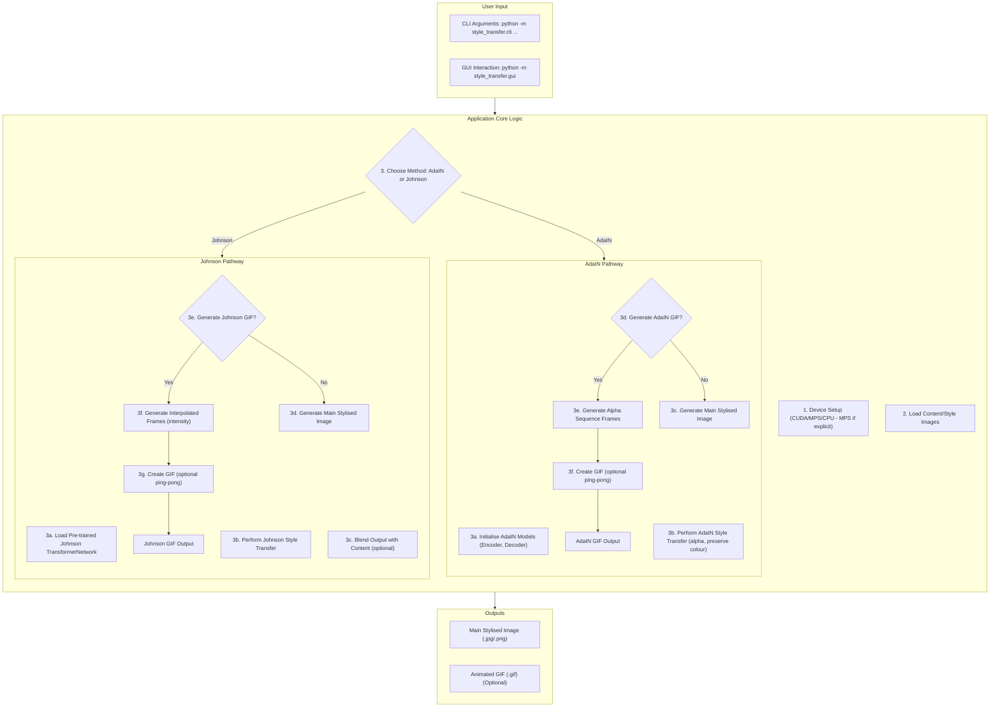
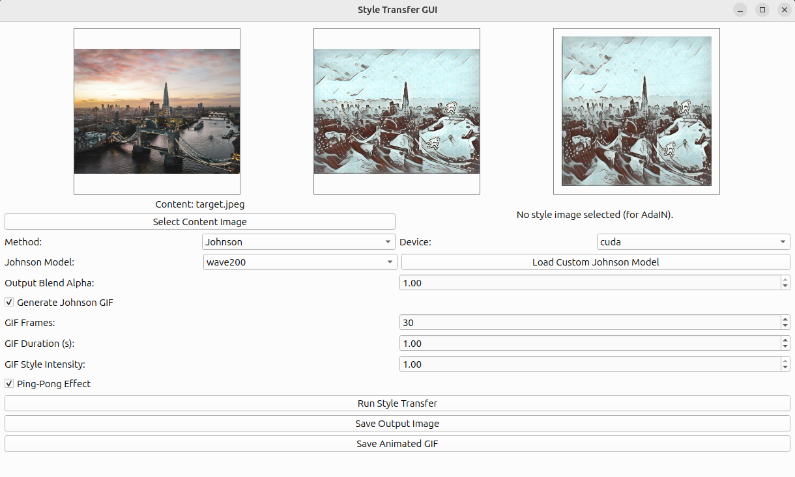

# Neural Style Transfer - Enhanced

A modern, PyTorch-based application for neural style transfer, offering multiple techniques including AdaIN (Adaptive Instance Normalisation) and Johnson's Fast Neural Style Transfer. This project provides a versatile command-line interface (CLI) and an intuitive graphical user interface (GUI) for applying the artistic style of one image to the content of another. It supports CPU, NVIDIA CUDA GPUs, and Apple MPS (Metal Performance Shaders) if explicitly selected. Automatic device detection prioritises CUDA, then CPU.

## Features

-   **Multiple Style Transfer Techniques:**
    -   **AdaIN (Adaptive Instance Normalisation):** Fast and effective style transfer based on Huang and Belongie's work.
    -   **Johnson's Fast Neural Style Transfer:** Utilises a pre-trained Transformer Network based on Johnson et al.'s work for specific styles.
-   **PyTorch Powered:** Built on PyTorch for flexibility and performance.
-   **Device Selection:** Supports NVIDIA CUDA GPUs and Apple MPS (if available and explicitly selected). Automatic device detection (`--device auto` in CLI) currently prioritises CUDA, then defaults to CPU (it does not automatically select MPS over CPU in 'auto' mode).
-   **Command-Line Interface (CLI):** Comprehensive CLI for batch processing and scripting (`python -m style_transfer.cli`).
-   **Graphical User Interface (GUI):** User-friendly GUI for interactive style transfer (`python -m style_transfer.gui`), allowing selection of available devices including MPS.
-   **Advanced GIF Generation:**
    -   Create animated GIFs showcasing the style transfer process.
    -   For AdaIN: Alpha blending between content and stylised image.
    -   For Johnson: Style intensity interpolation.
    -   Option for "Ping-Pong" effect in GIFs (plays forwards then backwards).
    -   Customisable frame count and duration for GIFs.
-   **Customisable Style Strength (AdaIN):** Control the intensity of the stylisation using an `alpha` parameter.
-   **Colour Preservation (AdaIN):** Option to retain the original colour palette of the content image.
-   **Output Blending (Johnson):** Control the blend between the stylised output and the original content image for the final static image.
-   **Input Image Resizing:** Automatically resizes input images to a specified maximum dimension, maintaining aspect ratio.
-   **Modular Codebase:** Well-structured package with refactored GUI components for better maintainability.
-   **Testing:** Includes a `pytest` suite.

## Core Concepts

### 1. AdaIN (Adaptive Instance Normalisation)

1.  **Feature Extraction:** Content and style images are passed through a pre-trained VGG19 encoder (up to `relu4_1`).
2.  **Instance Normalisation & Style Alignment:** Content features are normalised, then scaled and shifted using the mean and standard deviation of the style features.
3.  **Alpha Blending:** The `alpha` parameter controls the blend between original content features and AdaIN-stylised features.
4.  **Decoding:** A decoder network reconstructs the stylised image from the blended features.
    *   **Key AdaIN Components (in `style_transfer/models/adain.py`):** `Encoder`, `AdaIN` layer, `Decoder`, encapsulated in `StyleTransferModel`.

### 2. Johnson's Fast Neural Style Transfer

1.  **Pre-trained Transformer Network:** A single, pre-trained feed-forward convolutional network (`TransformerNetwork` or `TransformerNetworkTanh` from `style_transfer/models/johnson_transformer.py`) learns a specific style.
2.  **Direct Stylisation:** The content image is passed directly through this trained Transformer Network to produce the stylised output. This method is very fast at inference time for the style it was trained on.
    *   **Key Johnson Components (in `style_transfer/models/johnson_transformer.py`):** `TransformerNetwork` (or `TransformerNetworkTanh`), `JohnsonNet` (wrapper class).

## Application Flow Diagram



## Screenshots and Outputs

### GUI Screenshot
Below is a screenshot of the main application window:



### Example GIF Outputs
The application can generate animated GIFs showcasing the stylisation process, including a "ping-pong" effect (playing forwards then backwards).

**AdaIN GIF Example (Alpha Blending with Ping-Pong):**
*(This GIF demonstrates the gradual application of style via alpha blending)*


**Johnson GIF Example (Style Interpolation with Ping-Pong):**
*(This GIF demonstrates style intensity interpolation for a pre-trained Johnson model)*


## Requirements

-   Python 3.10 or higher.
-   Dependencies are managed using `uv` and defined in `pyproject.toml`.
-   Core libraries include:
    -   PyTorch (refer to [pytorch.org](https://pytorch.org/) for installation instructions suitable for your system, especially if using CUDA).
    -   PySide6 (for the GUI).
    -   imageio (for GIF creation, `imageio-ffmpeg` might be needed as an extra for full codec support).
    -   Pillow (for image processing).

## Installation

1.  **Install UV (if not already installed):**
    UV is a very fast Python package installer and resolver, written in Rust.
    Follow the official installation instructions: [https://github.com/astral-sh/uv#installation](https://github.com/astral-sh/uv#installation)
    For example:
    ```bash
    # On macOS and Linux
    curl -LsSf https://astral.sh/uv/install.sh | sh
    # On Windows
    irm https://astral.sh/uv/install.ps1 | iex
    ```
    Verify installation: `uv --version`

2.  **Clone the repository:**
    ```bash
    git clone https://github.com/Mike-In-The-Cloud/style_transfer.git
    cd style_transfer
    ```

3.  **Create and activate a virtual environment (recommended):**
    ```bash
    python3 -m venv .venv
    source .venv/bin/activate  # On Windows: .venv\Scripts\activate
    ```

4.  **Install dependencies using UV:**
    First, ensure PyTorch is installed, following official instructions for your system, especially if CUDA is needed: [https://pytorch.org/get-started/locally/](https://pytorch.org/get-started/locally/)
    (UV can install PyTorch, but for specific CUDA versions, manual installation or careful specification might be preferred).

    Then, install the project and its dependencies:
    ```bash
    # Install dependencies including optional 'test' extras if defined in pyproject.toml
    uv pip install -e ".[test]"
    # Or for just runtime dependencies:
    # uv pip install -e .
    ```

5.  **Download Pre-trained Models:**
    The application requires pre-trained model weights to function. These files are **not** included in this repository and must be downloaded manually. Place them into the `models/` directory in the root of this project.

    For detailed instructions and sources, please refer to the `models/README.md` file. A summary is provided below:

    *   **For AdaIN (Adaptive Instance Normalisation):**
        *   `vgg_normalised.pth` (VGG19 Encoder weights)
        *   `decoder.pth` (AdaIN Decoder weights)
        *   **Source & Credits:** These are typically from Huang and Belongie's work, often found in implementations like **[naoto0804/pytorch-AdaIN](https://github.com/naoto0804/pytorch-AdaIN)**.

    *   **For Johnson's Fast Neural Style Transfer:**
        *   Various `.pth` files for different styles (e.g., `candy.pth`, `mosaic.pth`, `rain_princess.pth`, `udnie.pth`).
        *   **Source & Credits:** Based on Johnson et al.'s work, often found in repositories like **[rrmina/fast-neural-style-pytorch](https://github.com/rrmina/fast-neural-style-pytorch)** and similar collections.

    **Summary of files to place in the `./models/` directory:**
    1.  `vgg_normalised.pth`
    2.  `decoder.pth`
    3.  One or more Johnson style `.pth` files (e.g., `candy.pth`).

## Usage

### 1. Command-Line Interface (CLI)

The CLI is accessed via `python -m style_transfer.cli`.

**Common Options:**

*   `--content PATH`: Path to the content image (required).
*   `--output PATH`: Path for the stylised output image (default: `styled_output.png`).
*   `--model_type {adain,johnson}`: Type of model (default: `adain`).
*   `--device {cuda,cpu,mps,auto}`: Compute device (default: `auto`).
*   `--max_size INT`: Maximum dimension for resizing images (default: 512).

**AdaIN Specific Options (if `model_type` is `adain`):**

*   `--style PATH`: Path to the style image (required for AdaIN).
*   `--alpha FLOAT (0.0-1.0)`: Style strength (default: 1.0).
*   `--preserve_color`: Preserve content image colour.
*   `--generate_adain_gif`: Generate an alpha-blending GIF.
*   `--adain_gif_frames INT`: Number of frames for AdaIN GIF (default: 20).
*   `--adain_gif_duration FLOAT`: Duration per frame in AdaIN GIF (seconds, default: 0.1).
*   `--adain_gif_ping_pong`: Enable ping-pong effect for AdaIN GIF.
*   `--adain_gif_path PATH`: Output path for the AdaIN GIF.

**Johnson Specific Options (if `model_type` is `johnson`):**

*   `--johnson_model_weights PATH`: Path to Johnson model `.pth` file (required for Johnson, relative to project root or absolute).
*   `--style PATH`: (Optional) Path to a style image. While Johnson's method uses a pre-trained model for a specific style, providing a style image here might be used for consistency in output naming or future features, but it does not actively participate in the stylisation process of a pre-trained Johnson model. The GUI creates a dummy one if not provided.
*   `--johnson_output_blend_alpha FLOAT (0.0-1.0)`: Blend final Johnson output with content image (default: 1.0, full style).
*   `--generate_johnson_gif`: Generate a style-interpolation GIF.
*   `--johnson_gif_frames INT`: Number of frames for Johnson GIF (default: 20).
*   `--johnson_gif_duration FLOAT`: Duration per frame in Johnson GIF (seconds, default: 0.1).
*   `--johnson_gif_style_intensity FLOAT (0.0-1.0)`: Style intensity at the end of the Johnson GIF (default: 1.0).
*   `--johnson_gif_ping_pong`: Enable ping-pong effect for Johnson GIF.
*   `--johnson_gif_path PATH`: Output path for the Johnson GIF.

**CLI Examples:**

*   **AdaIN Style Transfer:**
    ```bash
    python -m style_transfer.cli --content example_images/content.jpg --style example_images/style.jpg --output output/adain_styled.jpg --alpha 0.7 --preserve_color
    ```
*   **AdaIN GIF with Ping-Pong:**
    ```bash
    python -m style_transfer.cli --content example_images/content.jpg --style example_images/style.jpg --output output/adain_styled_gif.jpg --generate_adain_gif --adain_gif_path output/adain_animation.gif --adain_gif_frames 30 --adain_gif_ping_pong
    ```
*   **Johnson's Style Transfer:**
    ```bash
    python -m style_transfer.cli --model_type johnson --johnson_model_weights models/candy.pth --content example_images/content.jpg --output output/johnson_styled.jpg
    ```
*   **Johnson GIF with Ping-Pong:**
    ```bash
    python -m style_transfer.cli --model_type johnson --johnson_model_weights models/mosaic.pth --content example_images/content.jpg --output output/johnson_styled_gif.jpg --generate_johnson_gif --johnson_gif_path output/johnson_animation.gif --johnson_gif_frames 25 --johnson_gif_style_intensity 0.8 --johnson_gif_ping_pong
    ```

For all options and help: `python -m style_transfer.cli --help`

### 2. Graphical User Interface (GUI)

Launch the GUI using:
```bash
python -m style_transfer.gui
```

The GUI provides an interactive way to:
-   Select content and style images (for AdaIN).
-   Choose between AdaIN and Johnson style transfer methods.
-   Select pre-trained Johnson models (from the `models/` directory) or load custom ones.
-   Adjust parameters for each method (alpha, preserve colour, output blend, GIF options including ping-pong).
-   Preview the stylised image.
-   Generate and preview animated GIFs.
-   Save the output image and GIF.
-   Select the computation device (CPU, CUDA, or MPS if available).

Refer to the [GUI Screenshot](#gui-screenshot) section for a visual.

## Project Structure

The project is organised as follows:

```text
.
├── style_transfer/                 # Main package directory (see details below)
│   ├── __init__.py
│   ├── cli.py
│   ├── gui.py
│   ├── models/
│   ├── gui_components/
│   └── utils/
├── models/                         # Directory for pre-trained model weights (.pth files)
│   └── README.md                   # Instructions for acquiring model weights
├── example_images/                 # Example content and style images
│   ├── content.jpg
│   └── style.jpg
├── images/                         # Contains GUI screenshot and example GIFs for this README
│   ├── gui.png
│   ├── target_styled_animatedwith_johnson_wave200.gif
│   └── target_styled_with_style_adain_sequence.gif
├── output/                         # Default directory for stylised images and GIFs (user-created)
├── tests/                          # Test suite
├── .venv/                          # Virtual environment directory (if created, and in .gitignore)
├── .gitignore
├── pyproject.toml                  # Project metadata and dependencies for UV/Poetry
├── uv.lock                         # Lock file generated by UV (if using uv)
├── pytest.ini                      # Pytest configuration
├── HANDOVER.md                     # Original handover document
└── README.md                       # This file (main project README)
```

### Details of the `style_transfer/` package

The `style_transfer/` directory is the core of the application. For a more detailed breakdown of each file within this package, please see `style_transfer/README.md`. Here's a summary of its components:

-   **`__init__.py`**: Initialises the package and exports key components.
-   **`cli.py`**: Contains the CLI logic and the main `run_style_transfer_pipeline()` function, which is the central processing unit for both CLI and GUI operations.
-   **`gui.py`**: Implements the `MainWindow` for the PySide6 GUI application.
-   **`models/` (sub-directory):** Contains the PyTorch model definitions.
    -   `adain.py`: Defines the `Encoder`, `Decoder`, `AdaIN` layer, and the `StyleTransferModel` that combines them for AdaIN style transfer.
    -   `johnson_transformer.py`: Defines `TransformerNetwork`, `TransformerNetworkTanh`, and the `JohnsonNet` wrapper for Johnson's Fast Neural Style Transfer.
-   **`gui_components/` (sub-directory):** Contains reusable Qt widgets for the GUI.
    -   `adain_options_widget.py`: GUI controls for AdaIN parameters.
    -   `johnson_model_selection_widget.py`: GUI controls for selecting Johnson models.
    -   `johnson_advanced_options_widget.py`: GUI controls for advanced Johnson parameters.
    -   `style_transfer_thread.py`: `QThread` subclass for running style transfer in the background, utilising `cli.run_style_transfer_pipeline()`.
-   **`utils/` (sub-directory):** Contains utility modules.
    -   `device_utils.py`: GPU/CPU/MPS device management.
    -   `image_processing.py`: Image loading, pre/post-processing.
    -   `model_utils.py`: Model loading utilities (especially for Johnson models).
    -   `video_utils.py`: GIF creation and frame generation utilities.

## Development & Testing

### Running Tests

(Assuming test dependencies like `pytest` and `pytest-cov` are installed via `uv pip install -e ".[test]"`)
```bash
pytest
```
To run with coverage:
```bash
pytest --cov=style_transfer --cov-report=term-missing --cov-report=html
```
(The `htmlcov/` directory will contain a detailed HTML coverage report.)

## Acknowledgements

This project builds upon the work and resources of others. We gratefully acknowledge:

-   **AdaIN Implementation & Models:**
    -   Huang, Xun, and Serge Belongie. "Arbitrary style transfer in real-time with adaptive instance normalization." *Proceedings of the IEEE international conference on computer vision.* 2017.
    -   **[naoto0804/pytorch-AdaIN](https://github.com/naoto0804/pytorch-AdaIN):** The pre-trained VGG19 encoder weights (`vgg_normalised.pth`) and the pre-trained AdaIN decoder weights (`decoder.pth`) are commonly sourced from this repository. The network architectures for the AdaIN encoder and decoder in this project are also based on their implementations.
-   **Johnson's Fast Neural Style Transfer & Models:**
    -   Johnson, Justin, Alexandre Alahi, and Li Fei-Fei. "Perceptual losses for real-time style transfer and super-resolution." *European conference on computer vision.* Springer, Cham, 2016.
    -   **[rrmina/fast-neural-style-pytorch](https://github.com/rrmina/fast-neural-style-pytorch):** The Johnson `TransformerNetwork` architecture and some pre-trained models are based on or inspired by this repository and similar Fast Neural Style Transfer implementations.
-   **Libraries:** This project relies on fantastic open-source libraries including PyTorch, PySide6, Pillow, and imageio.

## License

This project is licensed under the MIT Licence.